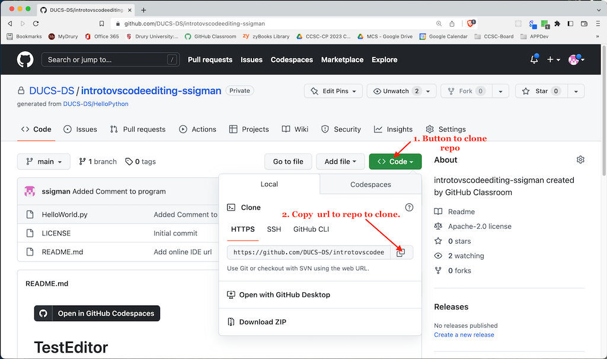
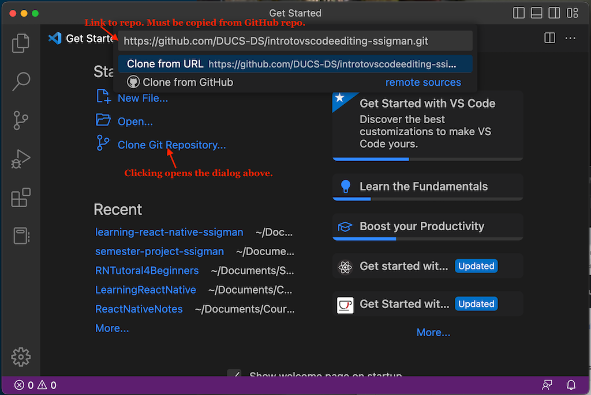
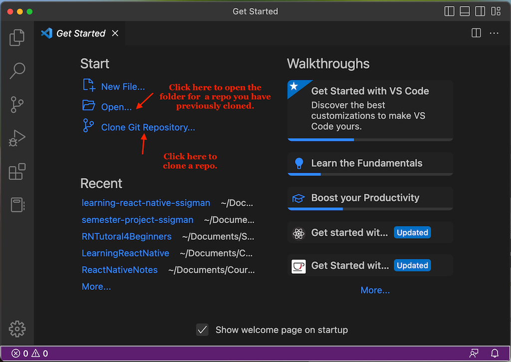
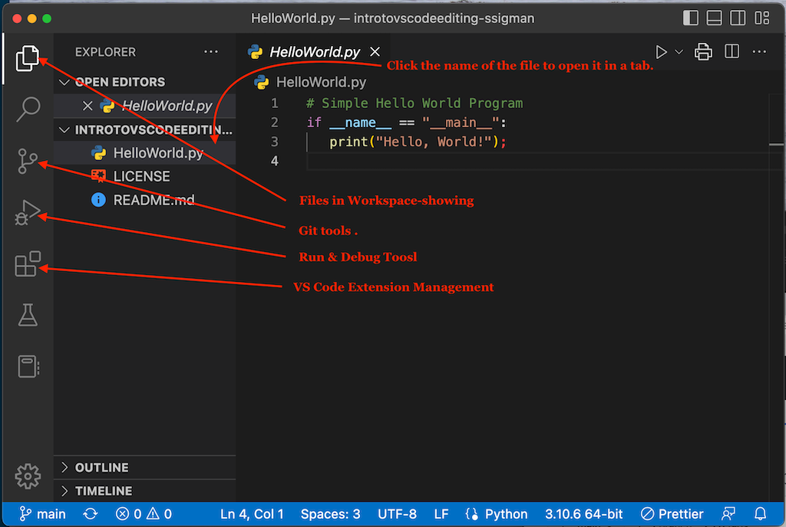
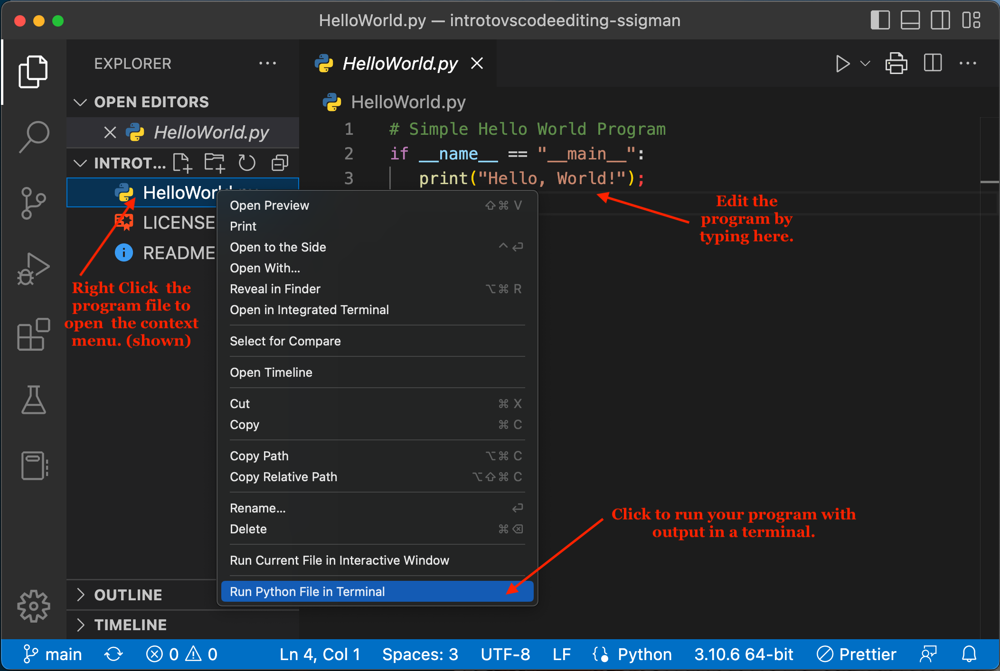
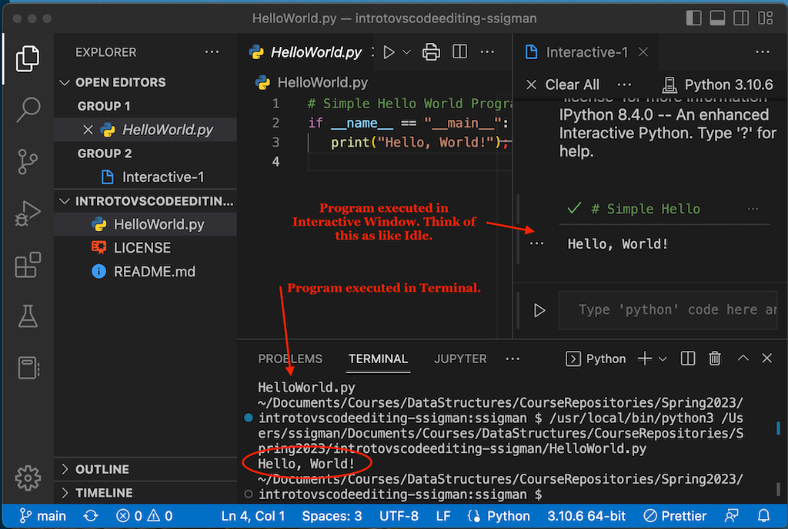

# Sp23Lab1

Lab 1 for Spring 23 Data Structures

## Using VS Code for an assignment

### Overview of the process we will use

All labs this semester will be made available as git repos, stored on GitHub. In order to complete the labs this semester on your local machine you will need to:

1.  _Clone the lab repo_: Cloning is the process of making a local copy of the lab's GitHub repo.
2.  _Editing/Doing the Lab_: Editing of the starter code for a lab or creating new Python files for a lab is done using your local VS Code software.
3.  _Committing & Pushing_: (I know the terminology is weird but I did not make it up!) Committing (officially a Commit) is the process of saving the changes made to the repo you cloned to your local repo. Pushing (officially a Push) is the process of saving the changes you have made to your lab's repo on GitHub. They are always done in that order: commit first, push second.

### Cloning a lab repo from GitHub

The frist step to clone the lab repo from GitHub is to copy the url of the repo. The following image illustrates the two steps in this process.

The second step is to make a copy of the repo on your local machine. We will use VS Code to clone the repo. Your VS Code should open to the Welcome page, which you can see in the background of the following image. Click the _Clone Git Repository_ link and you will see the dialog box shown in the foreground of the image. Click in the top box and past in the url of your lab GitHub repo. (You copied it in the step above.)

After you click the link in blue or press the enter (return) key your file explorer will open up asking where you want to save the repo. _Save it somewhere you will remember._ You will have to find it again.

### Using VS Code

_Cloning vs Opening_: The following diagram displays the Welcome page for VS Code. The preceding section discussed the use of the _Clone Git Repository_ command. You use it to make the initial copy of a GitHub repository on your local machine. The _Open_ command is used to open a git repository at all other times. Note that git repositories are stored on your computer as a folder. So you use the _Open_ command to open a folder. **Always open a folder in VS Code, not a file!**

_Navigating in VS Code_: An open repo in VS Code will appear similar to the following diagram. The Welcome tab can be closed by clicking the close icon in the tab. A file can be opened by clicking the name of the file in the left hand menu drawer. Note that you have to click the workspace icon in order to see the file and sub-folder content of the repo. In the case of the diagram, the HelloWorld.py file has been clicked once to display the file's contents in an editor tab.

The buttons in the left-most drawer are used to navigate within the functions that VS Code supplies. As the semester progresses you will learn to use most of these buttons.

_Note_: In git terminology, the folder that contains the files of the repo is known as the workspace.

_Editing & Running a Program_ Editing a program involves: (1) clicking on the name of the program file to open the editor tab, (2) editing the program by typing in the editor, and (3) saving the file (command-s on Mac computers and control-s on Windows). To run (execute) a program you right click on the name of the file and select Run Pyghon File in Terminal. The following image illustrates the context menu for running a program.

The output for a program is shown in the following image.

